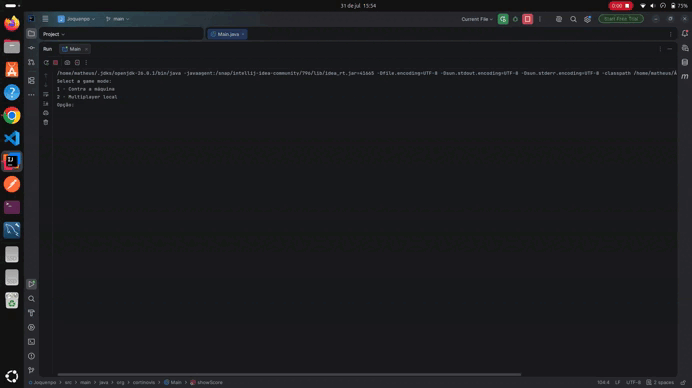

# 🎮 Jokenpô em Java

Um jogo de **Pedra, Papel e Tesoura** desenvolvido em **Java**, com foco em aplicar conceitos de **Programação Orientada a Objetos (POO)**, organização em camadas e boas práticas de desenvolvimento.

## ✨ Funcionalidades

* Modo **Jogador vs Máquina**
* Modo **Jogador vs Jogador**
* Escolha de gestos pelo terminal
* Sistema de placar
* Repetição automática da rodada em caso de empate
* Opção para:

    * Jogar novamente
    * Trocar o modo de jogo
    * Encerrar a aplicação

---

## 📁 Estrutura do Projeto

```text
src
└── org.cortinovis
    ├── domain
    │   ├── game
    │   └── player
    ├── service
    │   ├── battle
    │   ├── createPlayers
    │   └── selects
    └── Main.java
```

### `domain`

Contém as entidades e enums utilizados pelo jogo.

Exemplos:

* `Player`
* `Gesture`
* `GameMode`
* `GameAction`
* `BattleResult`

### `service`

Contém toda a lógica da aplicação.

#### `battle`

Responsável por determinar o vencedor de cada rodada.

#### `createPlayers`

Responsável pela criação dos jogadores e pela geração das jogadas da máquina.

#### `selects`

Responsável por toda a interação com o usuário:

* Seleção do modo de jogo
* Seleção do gesto
* Seleção da próxima ação

---

## 🛠 Tecnologias

* Java
* Programação Orientada a Objetos (POO)

---

## 📚 Conceitos utilizados

Durante o desenvolvimento foram aplicados diversos conceitos importantes de Java, como:

* Classes e Objetos
* Encapsulamento
* Enums
* Métodos
* Collections (`List`)
* `switch`
* Laços de repetição (`while` e `do-while`)
* Separação de responsabilidades
* Organização em pacotes
* Boas práticas de nomenclatura

---

## ▶️ Como executar

1. Clone o repositório.

```bash
git clone <url-do-repositorio>
```

1. Abra o projeto em uma IDE Java (IntelliJ IDEA, Eclipse ou VS Code).

2. Execute a classe `Main`.

---

## 🎯 Objetivo

Este projeto foi desenvolvido com o objetivo de praticar Java e fortalecer conhecimentos em Programação Orientada a Objetos através da implementação de um jogo simples, porém bem estruturado.

---

## 👨‍💻 Autor

Desenvolvido por **Matheus Cortinovis** como projeto de estudos em Java.

---

##🎥 Demonstração

